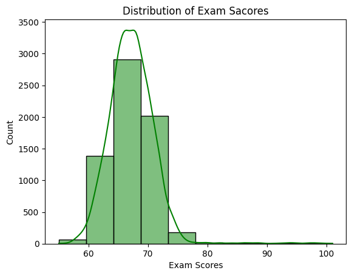
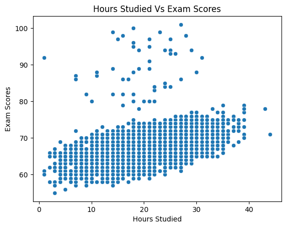
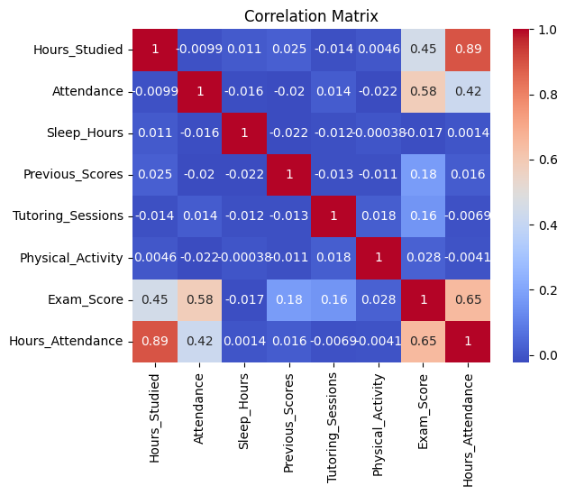
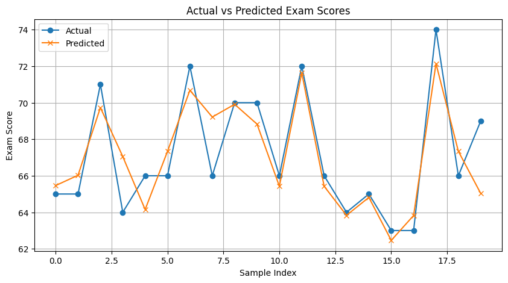
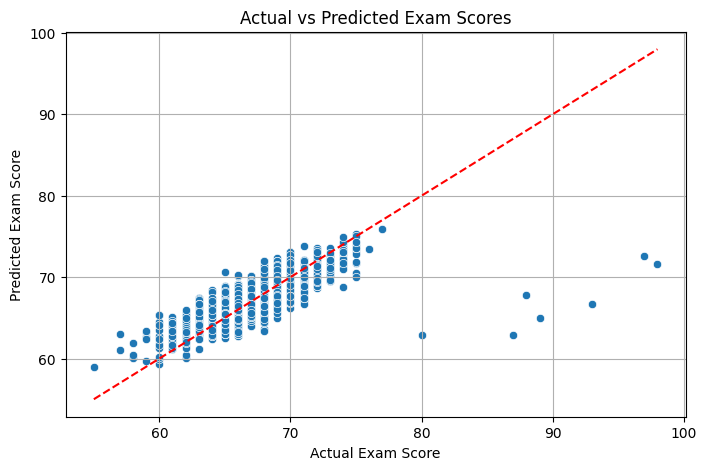

# Task 1 — Student Score Prediction

## 📌 Description
The goal of this task is to build a machine learning model that predicts students' exam scores based on:
- Hours Studied
- Attendance
- Derived feature: Hours_Attendance (Hours_Studied × Attendance)

---

## 📊 Dataset
**Source:** [Student Performance Factors — Kaggle](https://www.kaggle.com/datasets/lainguyn123/student-performance-factors)  
Each record contains study-related and lifestyle factors affecting student performance.

---

## 📈 Steps Performed
1. **Data Loading & Exploration**
   - Checked data types and missing values.
   - Created a new feature: `Hours_Attendance`.
   
2. **Visualization**
   - Distribution plot of Exam Scores.
   - Scatter plots for relationships between variables.
   - Correlation heatmap.

3. **Modeling**
   - Linear Regression model to predict `Exam_Score`.
   - Train-test split with 80/20 ratio.

4. **Evaluation**
   - Metrics:
     - **MAE:** 1.47
     - **MSE:** 5.80
   - Plotted Actual vs Predicted scores.

5. **Bonus**
   - Implemented Polynomial Regression (degree=2).
   - Tried alternative feature combinations.

---

## 📦 Libraries Used
- pandas  
- numpy  
- matplotlib  
- seaborn  
- scikit-learn

---
## 📷 Visualizations

**Distribution of Exam Scores**  


**Hours Studied vs Exam Scores**  


**Correlation Matrix**  


**Actual vs Predicted Exam Scores (Line Plot)**  


**Actual vs Predicted Exam Scores (Scatter Plot)**  



---

## 📜 How to Run
```bash
# Install dependencies
pip install pandas numpy matplotlib seaborn scikit-learn

# Run the script
python student_score_prediction.py
